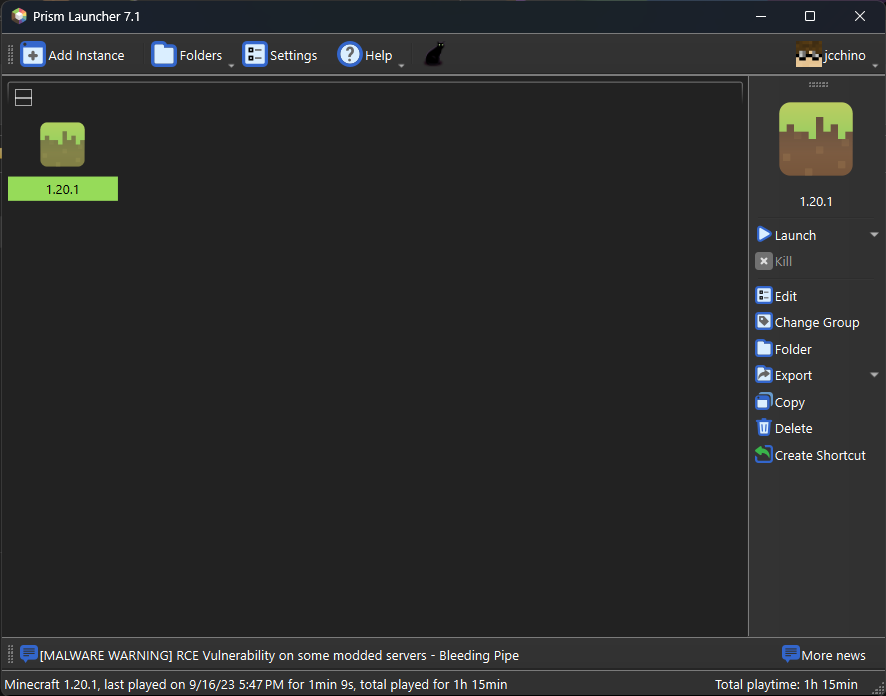
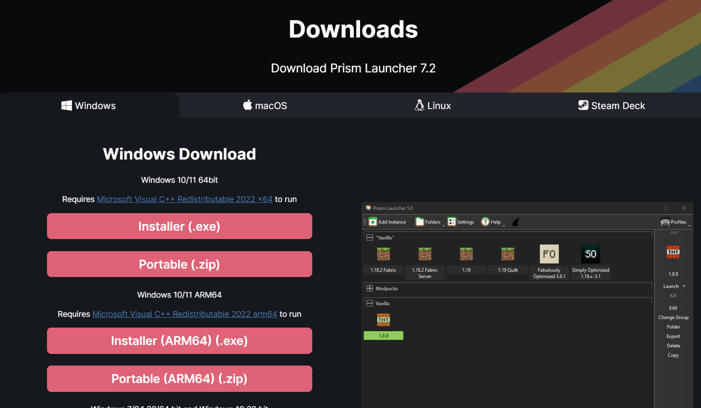
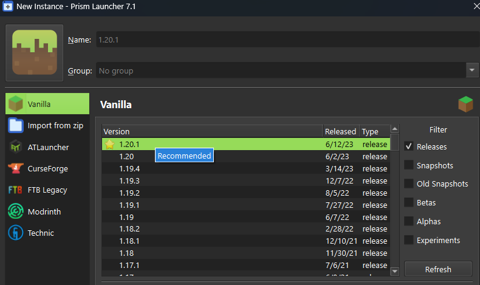
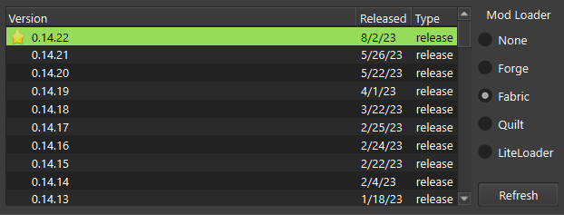
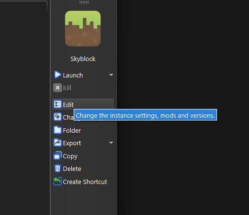
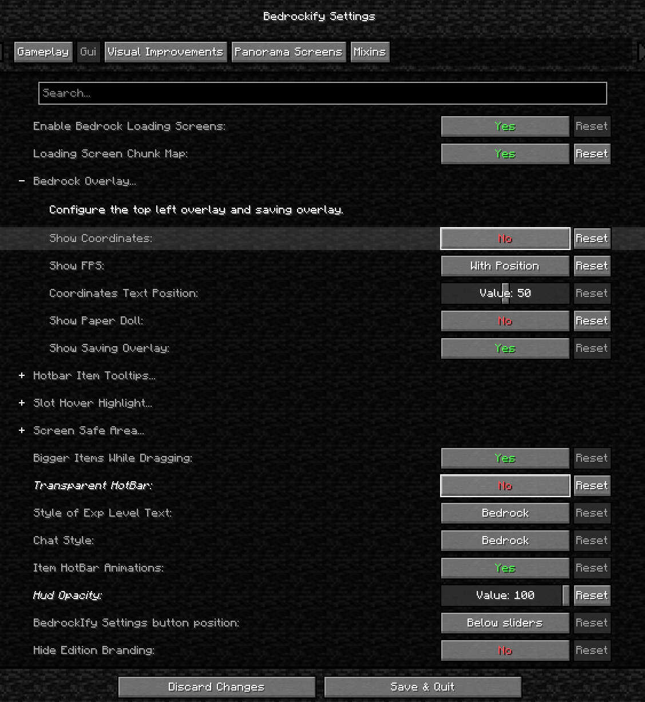

hello!

# Skyblock

## Main Guide

### Installing Prism Launcher

Prism Launcher is on Open Source Minecraft launcher with the ability to manage multiple instances, accounts and mods. Focused on user freedom and free redistributability.

1. Install Prism Launcher
   
2. Download and install Java JDK 17 from [Adoptium](https://adoptium.net/temurin/releases/)
3. Follow [this guide](https://www.youtube.com/watch?v=CA2fdUzChCo) on how to set it up
<iframe width="560" height="315" src="https://www.youtube.com/embed/CA2fdUzChCo?si=7tGsc10kJwpszxf2&amp;start=40" title="YouTube video player" frameborder="0" allow="accelerometer; autoplay; clipboard-write; encrypted-media; gyroscope; picture-in-picture; web-share" allowfullscreen></iframe>
4. Use version 1.20.1

5. Set the mod loader to Fabric

6. Click Edit

If you are using bedrockify
Set the following settings:  
[Required]
- Show Coordinates: `No`
- Show Paper Doll: `No`

[Optional]
- Transparent Hotbar: `No`
- HUD Opacity: `Value: 100`

## Optimization Mods

1. [Fabric API](https://modrinth.com/mod/fabric-api)
2. [Sodium](https://modrinth.com/mod/sodium)
3. [Sodium Extra](https://modrinth.com/mod/sodium-extra) - Features that shouldn't be in Sodium.
4. [Iris Shaders](https://modrinth.com/mod/iris)
5. [Shader List](https://modrinth.com/shaders)
6. [Indium](https://modrinth.com/mod/indium) - Sodium addon providing support for the Fabric Rendering API, based on Indigo
7. [Continuity](https://modrinth.com/mod/continuity) - A Fabric mod that allows for efficient connected textures
   _dependencies: Indium, Sodium_
8. [Fabric Language Kotlin](https://modrinth.com/mod/fabric-language-kotlin)
9. [Mod Menu](https://modrinth.com/mod/modmenu)
10. [Cloth Config API](https://modrinth.com/mod/cloth-config)
11. [Entity Culling](https://modrinth.com/mod/entityculling)
12. [FerriteCore](https://modrinth.com/mod/ferrite-core) - Memory usage optimizations
13. [Lithium](https://modrinth.com/mod/lithium) - No-compromises game logic/server optimization mod
14. [Memory Leak Fix](https://modrinth.com/mod/memoryleakfix) - A mod that fixes random memory leaks for both the client and server
15. [More Culling](https://modrinth.com/mod/moreculling) - A mod that changes how multiple types of culling are handled in order to improve performance
16. [Carpet-Fixes](https://modrinth.com/mod/carpet-fixes) - The carpet extension to fix all vanilla minecraft bugs
17. [Blanket](https://modrinth.com/mod/blanket) - Minecraft Client-fixes/tweaks
18. [FX's Rail Optimization](https://modrinth.com/mod/rail-optimization) - A simple mod that makes powered/activator rails turning on/off up to 4x faste
19. [Inventory Profiles Next](https://modrinth.com/mod/inventory-profiles-next) - Take control over you inventory. Sort. Move matching Items. Throw all. Locked slots. Gear sets! And much more.
20. [Krypton](https://modrinth.com/mod/krypton) - A mod to optimize the Minecraft networking stack
21. [ImmediatelyFast](https://modrinth.com/mod/immediatelyfast) - Speed up immediate mode rendering in Minecraft
22. [Concurrent Chunk Management Engine (Fabric)](https://modrinth.com/mod/c2me-fabric) - A Fabric mod designed to improve the chunk performance of Minecraft.
23. [Architectury API](https://modrinth.com/mod/architectury-api) - An intermediary api aimed to ease developing multiplatform mods.
24. [RightClickHarvest](https://modrinth.com/mod/rightclickharvest) - Allows you to harvest crops by right clicking
25. [libIPN](https://modrinth.com/mod/libipn) - Inventory Profiles Next GUI/Config library
26. [CreativeCore](https://modrinth.com/mod/creativecore)
27. [Iceberg](https://modrinth.com/mod/iceberg)
28. [Trinkets](https://modrinth.com/mod/trinkets)

## UI

1. [Simple Voice Chat](https://modrinth.com/plugin/simple-voice-chat) - A working voice chat in Minecraft!
2. [Eating Animation](https://modrinth.com/mod/eating-animation)A mod that adds sprite animations for edible and drinkable items.
3. [BetterF3](https://modrinth.com/mod/betterf3) - A mod that replaces Minecraft's original debug HUD with a highly customizable, more human-readable HUD.
4. [AppleSkin](https://modrinth.com/mod/appleskin) - Food/hunger-related HUD improvements
5. [Better Mount HUD](https://modrinth.com/mod/better-mount-hud) - Improves the ingame HUD while riding a mount
6. [Better Ping Display](https://modrinth.com/mod/better-ping-display-fabric
) - Adds a configurable numerical ping display to the player list
7. [BedrockIfy](https://modrinth.com/mod/bedrockify) - BedrockIfy is a fabric Minecraft Mod that implements some useful Minecraft Bedrock Edition features into Minecraft Java Edition.
8. [Not Enough Animations]() - Bringing first-person animations to the third-person
9. [Xaero's Minimap](https://modrinth.com/mod/xaeros-minimap) - Displays the nearby world terrain, players, mobs, entities in the corner of your screen. Lets you create waypoints which help you find the locations you've marked.
10. [Xaero's World Map](https://modrinth.com/mod/xaeros-world-map) - Adds a full screen world map which shows you what you have explored in the world. Works great together with Xaero's Minimap.

## Ambiance

Presence Footsteps
An Overly complicated Sound Mod
https://modrinth.com/mod/presence-footsteps

## Gameplay

Better Combat
Easy, spectacular and fun melee combat system from Minecraft Dungeons.
https://modrinth.com/mod/better-combat

Combat Roll
Adds combat roll ability, with related attributes and enchantments.
https://modrinth.com/mod/combat-roll

The Graveyard (FABRIC)
A mod that adds structures, mobs, bosses and blocks themed aroung the graveyard
https://modrinth.com/mod/the-graveyard-fabric

Geckolib
A 3D animation library for entities, blocks, items, armor, and more!
https://modrinth.com/mod/geckolib

Spell Engine
Data driven magic library
https://modrinth.com/mod/spell-engine

playerAnimator
animate the player
https://modrinth.com/mod/playeranimator

Spell Power Attributes
Spell Power entity attributes with related status effects and enchantments
https://modrinth.com/mod/spell-power

BetterEnd
New Biomes, mysterious rituals and Mobs for your End
https://modrinth.com/mod/betterend

BetterNether
More Biomes, More Mobs, More Tools for the fiery Dimension
https://modrinth.com/mod/betternether

Merchant Markers
Adds custom markers above villagers based on their professions!
https://modrinth.com/mod/merchant-markers

Paladins & Priests (RPG Series)
Protect and heal your friends as a Paladin or a Priest
https://modrinth.com/mod/paladins-and-priests

https://modrinth.com/mod/adaptive-tooltips
Highly configurable tooltip rendering, so you can always read them!
https://modrinth.com/mod/adaptive-tooltips

Runes
Craft runes to serve as ammo for spells
https://modrinth.com/mod/runes

Spell Engine
Data driven magic library
https://modrinth.com/mod/spell-engine

Simply Swords
Adds Spears, Glaives, Chakrams, Katanas, Greathammer/axes, Rapiers, and many more weapons!
https://modrinth.com/mod/simply-swords

## Optional
Craftify
Allows for you to control and display your music in-game!
https://modrinth.com/mod/craftify

3D Skin Layers
Render the player skin layer in 3d!
https://modrinth.com/mod/3dskinlayers

Charmonium
Ambient sounds and music in keeping with vanilla Minecraft
https://modrinth.com/mod/charmonium
--or--
AmbientSounds
#listentonature
https://modrinth.com/mod/ambientsounds
Use /cmdclientconfig to access the config menu
Use /ambient-debug to see which sounds are playing

Falling Leaves
Adds a neat little particle effect to leaf blocks
https://modrinth.com/mod/fallingleaves

## Server Side 
SleepWarp
Accelerates time when sleeping instead of skipping directly to day.
https://modrinth.com/mod/sleep-warp

/gamerule playersSleepingPercentage <value>

Gazebos (RPG Series)
Village structures hosting small spell libraries
https://modrinth.com/mod/gazebos

RPGStats
RPGStats adds simple, easy to understand stats to your minecraft game
https://modrinth.com/mod/rpgstats
/rpgstats command

ChoiceTheorem's Overhauled Village
Enhances and creates new villages and pillager outposts, that perfectly fit into your Minecraft world.
https://modrinth.com/mod/ct-overhaul-village

When Dungeons Arise
Adds various elegant -and likely hostile- roguelike dungeons and structures that generate on your worlds!
https://modrinth.com/mod/when-dungeons-arise

Chunky
Pre-generates chunks, quickly and efficiently

TabTPS
https://modrinth.com/plugin/tabtps
Monitor your server's performance in the tab menu, boss bar, and action bar